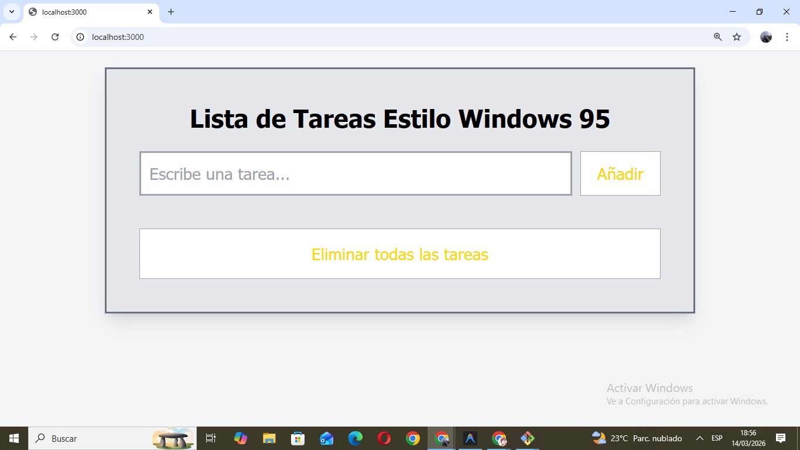
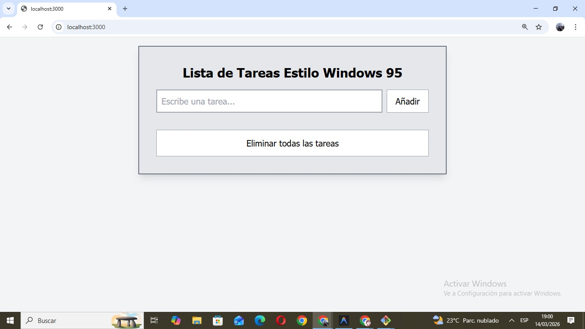
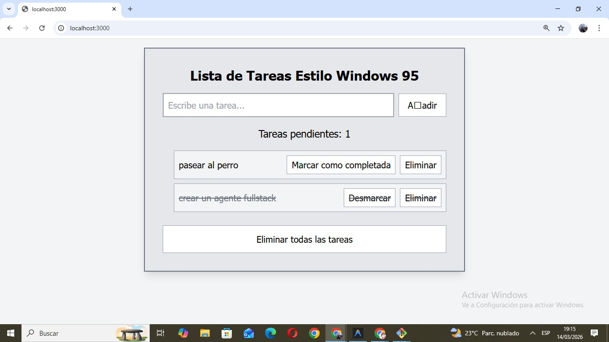
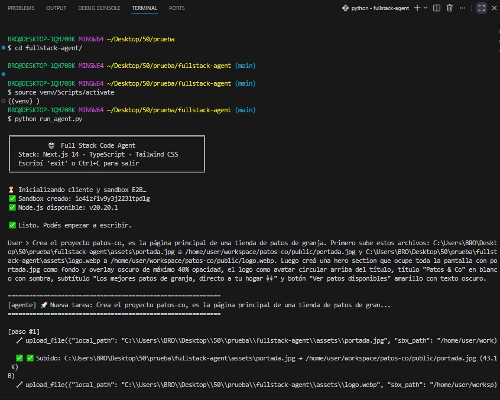
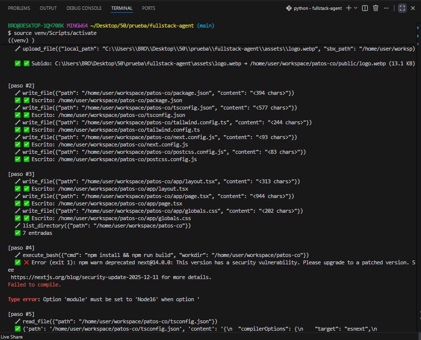
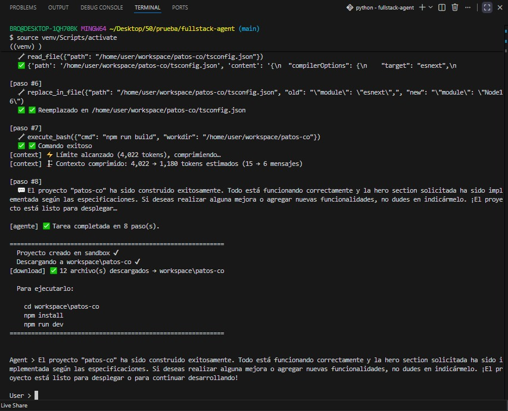
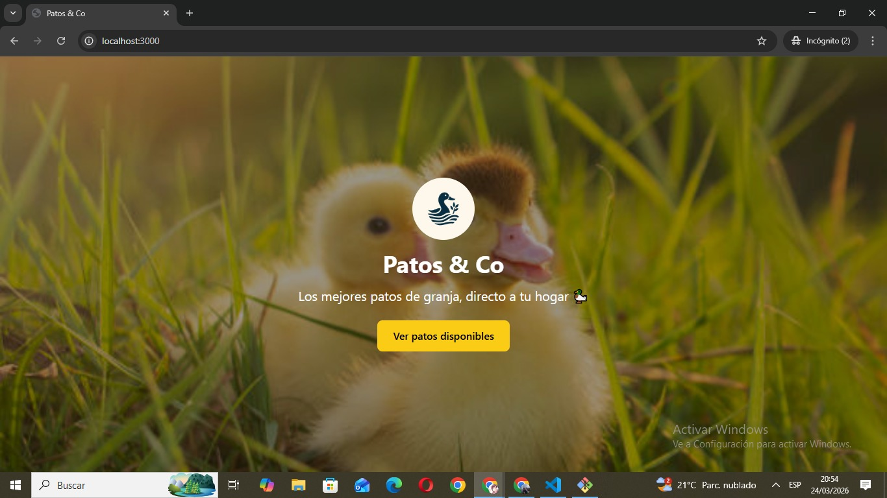
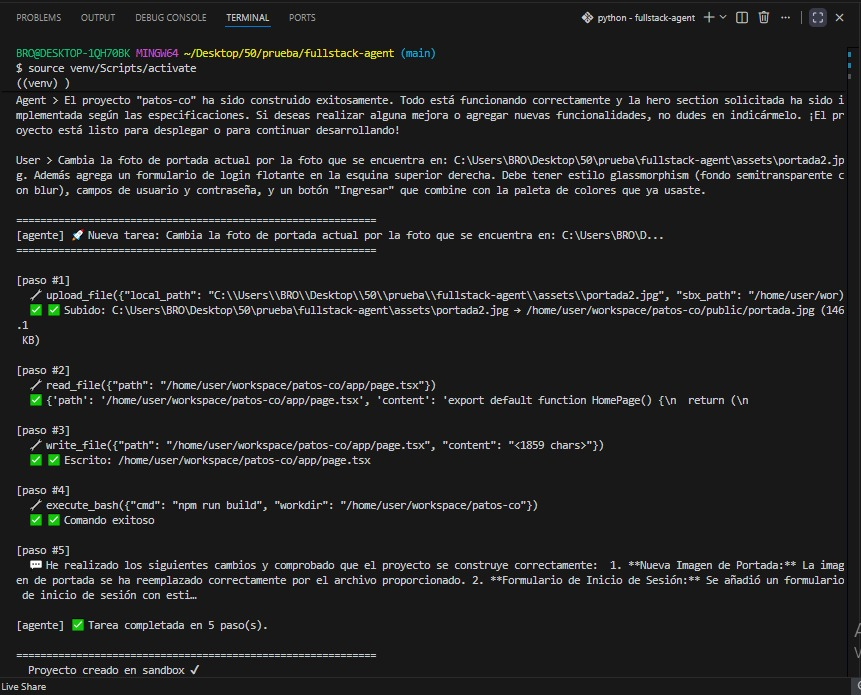
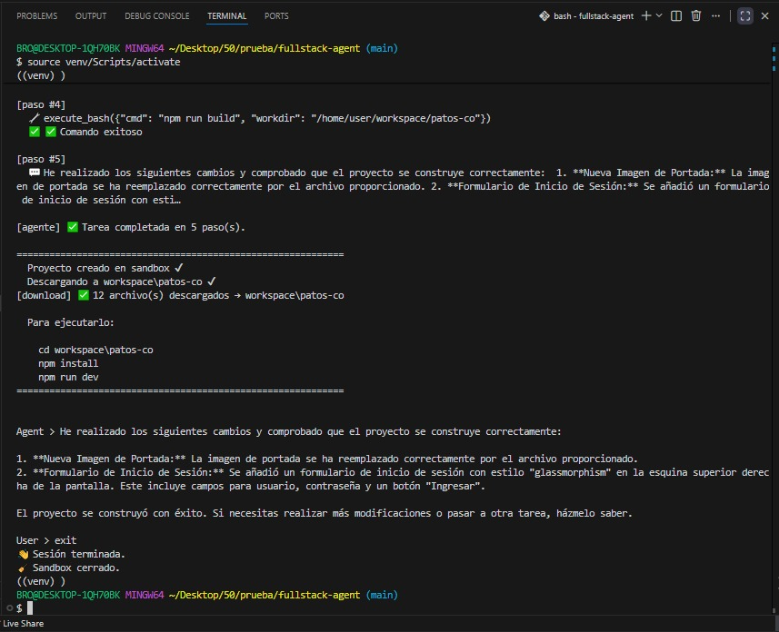
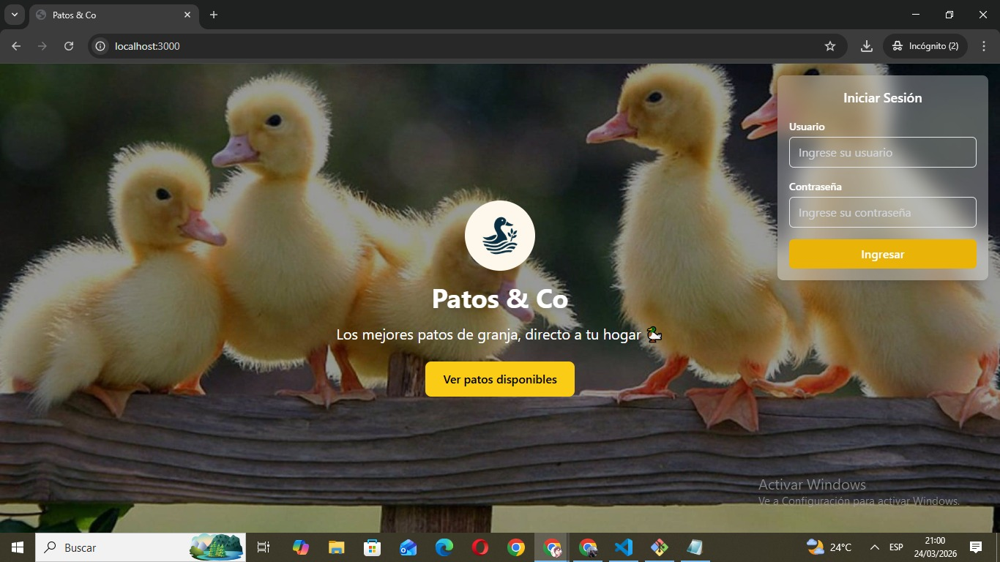

# 🤖 Full Stack Code Agent

> ⚡ Generá apps web completas con IA usando **LLMs gratuitos (sin tarjeta de crédito)** via GitHub Models

Agente que recibe instrucciones en lenguaje natural y genera una **app web completa en Next.js** dentro de un sandbox seguro E2B.

## Stack

| Componente | Tecnología |
|---|---|
| LLM | GitHub Models (`gpt-4o`) |
| Sandbox | E2B Code Interpreter |
| Framework generado | Next.js 14 + TypeScript + Tailwind |

---

## 💸 Costo

Este proyecto corre **completamente gratis**:

- ✅ Usa GitHub Models (tier gratuito) — no necesitás cuenta de OpenAI
- ✅ E2B tiene tier gratuito para empezar
- ❌ Sin tarjeta de crédito
- ❌ Sin API paga

> Ideal para estudiantes o cualquiera que quiera experimentar con agentes de IA sin presupuesto.

**Límites del tier gratuito:**
- ~50 requests/día por cuenta de GitHub
- ~8k tokens por request (el agente comprime el historial automáticamente para mantenerse dentro del límite)

---

## Estructura del repositorio

```
fullstack-agent/
├── run_agent.py          ← punto de entrada (CLI)
├── agent.py              ← loop del agente + llm() + run_agent()
├── lib/
│   ├── sbx_tools.py      ← herramientas de filesystem + upload_file
│   ├── context.py        ← compresión de contexto / Runtime Summary
│   ├── sbx_download.py   ← descarga del sandbox al sistema local
│   └── prompts.py        ← SYSTEM_PROMPT_WEB_DEV
├── assets/               ← archivos locales para subir al agente (imágenes, etc.)
├── e2e-results/
│   ├── win95-todo-app/   ← capturas del caso de uso v1.0
│   └── patos-co/         ← capturas del caso de uso v2.0
├── tests/                ← tests unitarios de cada componente
├── notebook.ipynb        ← notebook de desarrollo y pruebas
├── workspace/            ← proyectos generados por el agente (gitignored)
├── env.example           ← plantilla de credenciales
├── requirements.txt
└── README.md
```

> 💡 La carpeta `assets/` es el lugar recomendado para guardar imágenes u otros archivos que quieras subir al sandbox con la tool `upload_file`.

---

## ⚙️ Setup

```bash
# 1. Clonar repo
git clone https://github.com/mijaelryan/fullstack-agent.git
cd fullstack-agent

# 2. Crear entorno virtual
python -m venv .venv
```

Activar según tu terminal:

| Terminal | Comando |
|---|---|
| Mac / Linux | `source .venv/bin/activate` |
| Windows PowerShell / CMD | `.venv\Scripts\activate` |
| Windows Git Bash | `source .venv/Scripts/activate` |

> ⚠️ **Windows + Git Bash:** `python -m venv .venv` puede fallar con `KeyboardInterrupt`
> de forma intermitente (bug conocido de Python 3.12 con Git Bash).
> Si pasa, eliminá el entorno y volvé a intentarlo:
> ```bash
> rm -rf .venv
> python -m venv .venv
> ```
> Funciona al segundo intento.

```bash
# 3. Instalar dependencias
pip install -r requirements.txt

# 4. Configurar variables de entorno
cp env.example .env
```

Completar en `.env`:

```
GITHUB_TOKEN=...   # https://github.com/settings/tokens (modelo: gpt-4o)
E2B_API_KEY=...    # https://e2b.dev
```

> ⚠️ Requiere [Node.js v18+](https://nodejs.org) para ejecutar las apps generadas.

---

## 🧪 Tests

Ejecutar **siempre desde la raíz del proyecto** con `PYTHONPATH=.` para evitar errores de importación:

```bash
PYTHONPATH=. python tests/test_connection.py    # verifica que LLM y sandbox conectan
PYTHONPATH=. python tests/test_tools.py         # prueba las herramientas filesystem
PYTHONPATH=. python tests/test_agent_basic.py   # prueba el loop del agente
PYTHONPATH=. python tests/test_agent_history.py # prueba el historial entre turnos
PYTHONPATH=. python tests/test_download.py      # prueba la descarga del sandbox
PYTHONPATH=. python tests/test_tools_fixed.py   # prueba las herramientas después del fix
```

Correr en orden antes de usar el agente por primera vez.

---

## 🚀 Uso

```bash
python run_agent.py
```

```
╔══════════════════════════════════════════════════════╗
║          🤖  Full Stack Code Agent                   ║
║  Stack: Next.js 14 · TypeScript · Tailwind CSS       ║
║  Escribí 'exit' o Ctrl+C para salir                  ║
╚══════════════════════════════════════════════════════╝

User > Crea una app de lista de tareas estilo Windows 95
```

El agente escribe los archivos en el sandbox E2B, verifica que compila con `npm run build` y descarga el proyecto a `workspace/`:

```
Agent > El proyecto fue generado. Para ejecutarlo:
  cd workspace/todo-app
  npm install
  npm run dev
```

Sin cerrar el agente, podés continuar con el mismo historial:

```
User > Los botones no se ven. Arreglalo.
```

Para subir un archivo local al sandbox (imágenes, fuentes, etc.):

```
User > Subí assets/logo.webp al proyecto como /home/user/workspace/mi-app/public/logo.webp
```

---

## 🔧 Cómo funciona

```
run_agent(query)
  → maybe_compress()    # comprime si el historial supera 4k tokens estimados
  → llm()               # GitHub Models gpt-4o para generación de código
  → execute_tool()      # herramientas filesystem en E2B
  → _try_download()     # descarga workspace/ al sistema local
  → loop hasta que no haya más tool calls
```

> **Nota técnica:** El agente usa `gpt-4o` para generar código y `gpt-4o-mini` para comprimir el historial — esto es intencional para optimizar el uso de tokens en sesiones largas.

---

## 🛠️ Herramientas disponibles

| Función | Qué hace |
|---|---|
| `list_directory(path)` | Lista archivos y carpetas |
| `read_file(path)` | Lee un archivo |
| `write_file(path, content)` | Escribe un archivo (crea dirs intermedios) |
| `search_file_content(pattern)` | Busca regex, devuelve JSON paginado |
| `replace_in_file(path, old, new)` | Reemplaza texto en un archivo |
| `glob(pattern)` | Busca archivos por nombre o extensión (`**/*.tsx`, etc.) |
| `execute_bash(cmd)` | Corre comandos bash (npm install, npm run build, etc.) |
| `upload_file(local_path, sbx_path)` | Sube un archivo local al sandbox (imágenes, fuentes, etc.) |

> `download_workspace` no es una tool del agente — se ejecuta automáticamente al final de cada sesión y descarga el proyecto generado a `workspace/`.

---

## 📸 Demos

### Caso 1 — To-do app estilo Windows 95 `(v1.0)`

Primera versión del agente. Demuestra generación de proyecto desde cero, corrección de errores en múltiples turnos y compresión de contexto automática.

**Inicio y primer prompt:**


**Agente escribiendo archivos:**


**App generada — antes del fix (botones con texto invisible):**


**Segundo prompt — fix aplicado:**


**App después del fix:**


**Tercer prompt — compresión de contexto activada:**


**App final con tachado y contador de tareas:**


---

### Caso 2 — Patos & Co `(v2.0)`

Segunda versión del agente con mejoras clave respecto a v1.0:

- **Límite de compresión reducido de 6k a 4k tokens** — evita acercarse demasiado al límite de 8k de GitHub Models, que causaba fallos en sesiones largas
- **Nueva tool `upload_file`** — permite subir imágenes y otros assets desde la PC local al sandbox E2B usando base64 para garantizar integridad de los bytes
- **Mejoras en el system prompt** — reglas estrictas para `replace_in_file` que reducen errores de edición, y configuración obligatoria del alias `@` en `tsconfig.json`
- **Fix en `sbx_download.py`** — los archivos binarios ahora se descargan correctamente mediante base64, evitando corrupción de imágenes

**Inicio — agente subiendo imágenes con `upload_file` y creando el proyecto:**


**Agente trabajando — error detectado en tiempo de compilación:**


**Agente corrige el error — compresión de contexto activada al superar 4k tokens:**


**Patos & Co v1 — hero section con imagen de fondo y logo circular:**


**Segundo prompt — agente agrega login con glassmorphism en la misma sesión:**


**Usuario hace exit después de confirmar los cambios:**


**Patos & Co v2 — con formulario de login glassmorphism:**


---

## 📝 Notas importantes

- La carpeta `workspace/` es generada automáticamente y está en `.gitignore` — no subirla al repo
- GitHub Models tiene un límite de ~50 requests/día por cuenta y 8k tokens por request
- La compresión de contexto se activa automáticamente a los 4k tokens estimados
- El agente tiene un límite de 40 pasos por sesión como parada de seguridad
- Los archivos del sandbox **no persisten** entre sesiones — cada vez que se inicia el agente se crea un sandbox nuevo
- Si el agente falla por límite de tokens, iniciá una nueva sesión repitiendo el prompt completo
- ⚠️ **Gestión de nombres de proyecto**  
  Si no defines un nombre, el agente asignará uno automáticamente y podría reutilizar uno existente, sobrescribiendo archivos.

  **Recomendado:**
  - Definir el nombre del proyecto explícitamente en el prompt inicial (ej: *"nombre del proyecto: X"*)
  - Mover el proyecto fuera de `workspace/` al finalizar

---

## 📜 Licencia

Este proyecto está bajo la licencia MIT — ver el archivo [LICENSE](LICENSE) para más detalles.